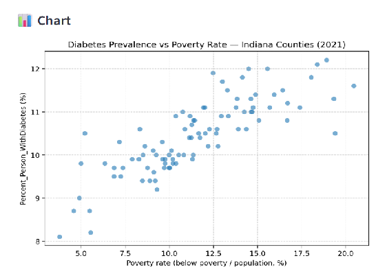
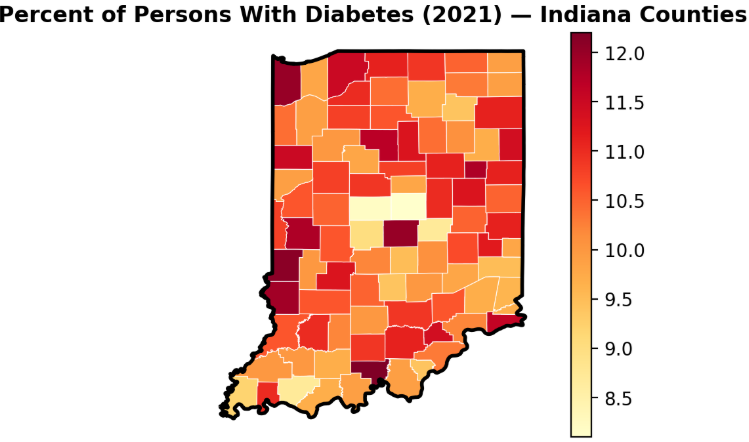

## SDoH Public Data Assistant

*Public data discovery and analysis for SDoH research*

The **SDoH Public Data Assistant** is a chat application that helps analysts explore and analyze public data repositories relevant to Social Determinants of Health (SDoH). You ask questions in natural language; a reasoning agent interprets them, discovers indicators across connected sources, fetches observations for places and time periods, and can run statistical analyses—including correlation, regression, and simple forecasts—and produce charts and maps from the results.

The assistant helps with data modeling: finding variables, understanding coverage and definitions, and comparing series across geographies before you build statistical, machine learning, or AI pipelines.

Today it connects to **Google Data Commons**, **Centers for Medicare & Medicaid Services (CMS) datasets**, and **CDC PLACES**. A planned capability is connecting your own database so you can explore local data alongside public repositories and relate the two (not yet implemented).

An optional **audit** pass reviews the agent's reasoning steps and final answer for gaps or improvements.

### Quickstart

To start the assistant with minimal setup:

1. **Install prerequisites:** [Docker Engine](https://docs.docker.com/engine/install/) with the [Docker Compose plugin](https://docs.docker.com/compose/install/), and Git. At least 8 GB RAM is recommended.
2. **Clone this repository:**

```
git clone https://github.com/SocialHealthAI/SDoH-Public-Data-Assistant.git
cd SDoH-Public-Data-Assistant
```

1. **Configure environment variables:** Copy `.env.example` to `.env` and set your keys.
  - `OPENAI_API_KEY` — required for the reasoning agent.
  - `DC_API_KEY` — required for Data Commons maps, place expansion, and batched observation fetches. Request a key from the [Data Commons API documentation](https://docs.datacommons.org/api/).
2. **Build and start the containers** (`public-data-assistant` and `data-commons-mcp`):

```
docker compose up
```

1. **Open the assistant** in your browser (default):

```
http://localhost:8052
```

For detailed instructions, see [installation.md](./documentation/installation.md).

### Features

A typical analysis flow:

1. **Discover indicators** — Search across connected public repositories for variables that match your topic (for example diabetes prevalence, opioid prescribing, or social isolation).
2. **Fetch observations** — Pull values for counties, states, ZIP Code Tabulation Areas, places, or census tracts for a chosen year.
3. **Analyze** — Run correlation, regression, descriptive statistics, or simple forecasts on wide tables the agent assembles.
4. **Visualize** — Generate charts or choropleth maps; boundaries come from Data Commons when `DC_API_KEY` is set.
5. **Review** — Optionally audit the agent’s tool steps and final answer.

### Example chats

The prompts below reflect workflows validated against the current public-data tools. Exact table rows and numeric results depend on repository releases and the model run.

#### Indicator discovery

```
What variables are available for diabetes? Include source and repository for each candidate.
```

##### 💬 Final Answer

The assistant searches **Google Data Commons**, **CMS**, and **CDC PLACES** and returns a markdown table with columns such as Name, Source, Repository, `indicator_id`, and `native_id` (for example `Percent_Person_WithDiabetes` from Data Commons).

#### County analysis (Data Commons)

```
For Indiana counties in 2021, build a wide table with poverty rate (Count\_Person\_BelowPovertyLevelInThePast12Months divided by population) and Percent\_Person\_WithDiabetes. Then show a scatter plot using those two columns
```

##### 💬 Final Answer

The agent fetches observations, builds one row per county with separate numeric columns and displays the table and the scatter plot.



#### Map (Data Commons)

```
show a map of the counties in Indiana for Percent_Person_WithDiabetes, in the year 2021
```

##### 💬 Final Answer

Map ready. The app renders an interactive choropleth in the chat UI.



#### Multi-source comparison (CDC PLACES + Data Commons)

```
Calculate the Pearson correlation between lack of social and emotional support among adults and unemployment rate for Ohio counties in 2023. Ignore rows with null values.
```

##### 💬 Final Answer

The agent discovers indicators in both repositories, aligns counties on `place_key`, builds a wide table, and returns correlation statistics. This pattern works well when PLACES supplies a measure Data Commons does not publish at county level.

### Architecture

See [architecture.md](./documentation/architecture.md) for diagrams and component descriptions.

#### Usage

See [usage.md](./documentation/usage.md) for example prompts and considerations.

#### Installation

See [installation.md](./documentation/installation.md) for installation and configuration.

#### What's Next?

See open issues and enhancements: [Issues · SocialHealthAI/SDoH-Public-Data-Assistant](https://github.com/SocialHealthAI/SDoH-Public-Data-Assistant/issues)