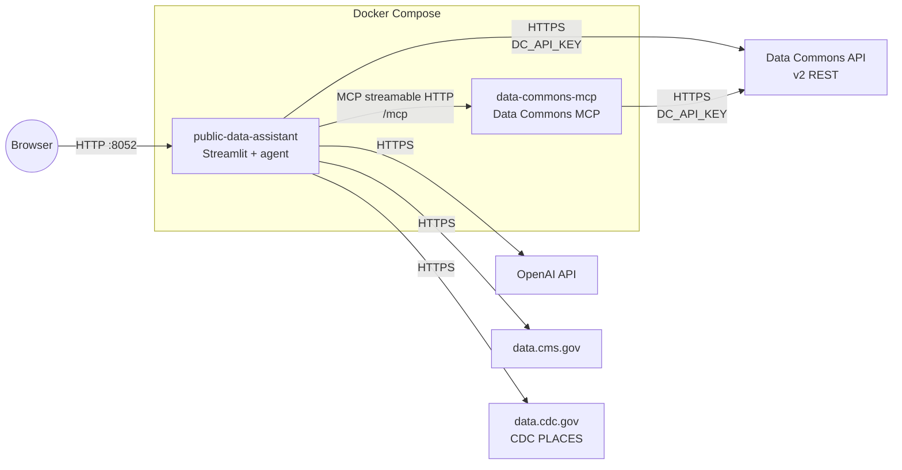
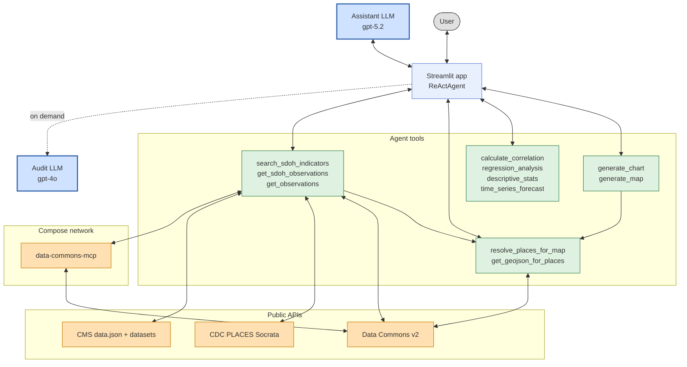

## Architecture

The **SDoH Public Data Assistant** runs as two Docker Compose services on a shared network. The chat UI and agent live in **public-data-assistant**; a local **data-commons-mcp** server provides Data Commons indicator search and an observations fallback. CMS and CDC PLACES are reached over the public internet from **public-data-assistant**—no additional containers are required for those repositories.

A planned capability connects **your own database** alongside public data (not implemented yet).

### Deployment

**public-data-assistant** (`analytic_assistant_build/dockerfile.openai`) mounts `./agents` at `/myapps` for development. It exposes the Streamlit UI on `ASSISTANT_HOST_PORT` (default `8052`). Environment variables include `OPENAI_API_KEY`, `DC_API_KEY`, and `DATACOMMONS_URI` (default `http://data-commons-mcp:3000/mcp` on the compose network).

**data-commons-mcp** (`datacommons_server_build/dockerfile`) runs the published `datacommons-mcp` HTTP server. It exposes `DATACOMMONS_CONTAINER_PORT` (default `3000`) and uses the same `DC_API_KEY` as the assistant.

### Application stack

The assistant is a Streamlit chat app (`streamlit_assistant.py`) backed by a LangChain **tool-calling agent** (`react_agent.py`). The agent iterates: choose a tool, run it, observe the result, repeat until it produces a final answer. An optional **audit** agent (`audit_agent.py`, separate model) reviews the user prompt, tool steps, and final answer when the user clicks **Run Audit**.

Charts and maps are generated as Python code in the agent run; **ChartRenderer** and **MapRenderer** execute that code in the Streamlit process and display results below the chat. Map geometry is not passed through the LLM context: `get_geojson_for_places` stores GeoJSON in the Streamlit session under a `geojson_ref` key that `generate_map` references at render time.

### Request flow

A typical analysis follows this pattern:

1. **Discover** — `search_sdoh_indicators` queries allowed sources (default: Data Commons, then CMS, then CDC PLACES) and returns ranked candidates with `indicator_id`, repository, and optional `metric_source`.
2. **Fetch** — `get_sdoh_observations` pulls values for one or more indicators, places, and years. Data Commons uses batched v2 API calls when `DC_API_KEY` is set; otherwise it falls back to MCP `get_observations` per place. CMS and CDC PLACES use their respective HTTP APIs inside the tool implementation.
3. **Shape** — The agent builds **wide** markdown tables (one numeric column per variable, one row per place) for multi-variable work.
4. **Analyze or visualize** — Statistics tools parse those tables; chart and map tools consume table data or structured payloads. Maps call `resolve_places_for_map` and `get_geojson_for_places` first when boundaries are needed.
5. **Review** — The user may expand logic steps or run the audit LLM on the completed turn.

### Data sources

| Source | Discovery | Observations | Maps / places |
|--------|-----------|--------------|---------------|
| **Google Data Commons** | MCP `search_indicators` via `search_sdoh_indicators` | v2 batch API (preferred) or MCP `get_observations` | `geoJsonCoordinates` via v2; place expansion via `datacommons-client` |
| **Centers for Medicare & Medicaid Services (CMS)** | data.cms.gov `data.json` catalog search | Per-dataset API inside `get_sdoh_observations` | Schema inferred per dataset; geo fields vary by program |
| **CDC PLACES** | Socrata measure index on data.cdc.gov | Socrata query API | County, place, ZCTA, tract levels per release |

All sources normalize to a shared **`place_key`** (usually a Data Commons DCID such as `geoId/39061` or `zip/45202`) so observations, correlation tables, and map layers can be joined.

### Agent tools

The assistant LLM can call the tools below. Rules for when to use each tool and how to format tables are defined in `agents/agent_system_prompt.txt`.

#### Search and observations

| Tool | Role |
|------|------|
| **search_sdoh_indicators** | Unified search across Data Commons, CMS, and CDC PLACES; interleaves results per source. |
| **get_sdoh_observations** | Preferred fetch for all repositories; returns long or wide tables. |
| **get_observations** | MCP fallback for a single Data Commons variable when `get_sdoh_observations` is unsuitable. |

Implementation: `agents/tools/sdoh_search_tool.py`, `agents/tools/sdoh_observations_tool.py`, `agents/tools/sdoh_search_merge.py`, `agents/tools/cdc_places_helpers.py`, `agents/tools/dc_v2_helpers.py`.

#### Places and geometry

| Tool | Role |
|------|------|
| **resolve_places_for_map** | Resolve names or ids to DCIDs and `place_key` values; expand parent→children via Data Commons v2 (requires `DC_API_KEY`). |
| **get_geojson_for_places** | Fetch boundaries for choropleth maps; stores geometry server-side by reference. |

Implementation: `agents/tools/resolve_places_tool.py`, `agents/tools/dc_place_expand.py`, `agents/tools/geojson_tool.py`.

#### Statistics

| Tool | Role |
|------|------|
| **calculate_correlation** | Pearson correlation and *p*-value between two numeric columns in a wide table. |
| **regression_analysis** | OLS regression with a named target column. |
| **descriptive_stats** | Mean, median, standard deviation, etc. |
| **time_series_forecast** | Simple exponential smoothing over a year column. |

Implementation: `agents/tools/correlation_tool.py`, `regression_tool.py`, `descriptive_stats_tool.py`, `time_series_tool.py`, `analysis_base_tool.py`.

#### Visualization

| Tool | Role |
|------|------|
| **generate_chart** | Emits matplotlib code; Streamlit renders it after the turn. |
| **generate_map** | Emits pydeck/Folium-style map code using `geojson_ref` and optional tabular `data`. |

Implementation: `agents/tools/chart_tool.py`, `map_tool.py`, `chart_renderer.py`, `map_renderer.py`.

### Key files

| Path | Purpose |
|------|---------|
| `agents/streamlit_assistant.py` | Chat UI, session state, chart/map rendering, audit trigger |
| `agents/react_agent.py` | Tool registration and agent run loop |
| `agents/agent_system_prompt.txt` | Agent instructions (search order, wide tables, PLACES rules) |
| `agents/audit_agent.py` | Independent review of a completed turn |
| `docker-compose.yaml` | Service definitions and port wiring |
| `.env.example` | Required and optional environment variables |

### Planned: local database integration

Future work will let you attach a private database so the agent can query local tables and relate them to public indicators. That path is not part of the current compose stack or tool surface.
