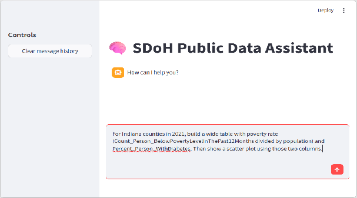

## Usage

Start the **SDoH Public Data Assistant** at:

```
http://localhost:8052
```

Enter prompts in the chat input. When the agent finishes, you can expand **intermediate tool steps** to see which indicators were searched, which observations were fetched, and how tables were shaped for analysis. An optional **audit** reviews the run for gaps or improvements.



### Connected data sources

| Source | Access | Typical use |
|--------|--------|-------------|
| Google Data Commons | MCP search + v2 API (with `DC_API_KEY`) | Broad SDoH, demographic, economic, and health series; map boundaries |
| Centers for Medicare & Medicaid Services (CMS) | data.cms.gov catalog + dataset APIs | Medicare utilization, prescribing, and program metrics (often age 65+) |
| CDC PLACES | Socrata API on data.cdc.gov | Small-area health and Health-Related Social Needs (HRSN) measures |

The agent discovers indicators with `search_sdoh_indicators`, fetches values with `get_sdoh_observations`, then may call analysis or visualization tools on **wide** markdown tables (one numeric column per variable, one row per place).

### Prompt tips

- **Name the geography and year** — e.g. “Indiana counties, 2021” or “Ohio, 2023”.
- **Ask for sources when exploring** — e.g. “include repository and indicator_id”.
- **For PLACES HRSN topics** (loneliness, food insecurity, housing insecurity) — mention `cdcplaces` or use wording the agent maps to PLACES; prefer age-adjusted prevalence when comparing counties.
- **For maps** — specify level (`county`, `zip`, `tract`, `state`) and place ids or a parent state/county. ZIP maps use `zip/#####` place keys, not `geoId/#####`.
- **Keep result sets focused** — very large county-by-county tables increase token use and can hit model rate limits. Filter to a state, limit years, or ask for top-*N* counties instead of all places nationwide.

Example (focused request):

```
Show diabetes prevalence and poverty rate for Indiana counties in 2021, then correlate the two columns.
```

Example (avoid overly broad requests):

```
List every county in the US with all CDC PLACES measures for all years.
```

### CMS notes

Many CMS metrics describe the **Medicare population (65+)**. When comparing CMS series to Data Commons or PLACES, prefer age-adjusted or clearly labeled measures and note population differences in your interpretation.
